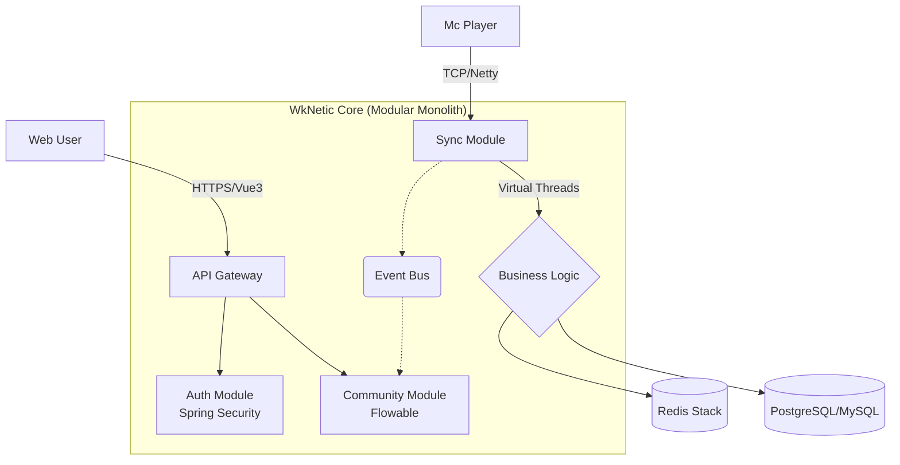

# ⚡ WkNetic

**连接 Minecraft 游戏世界与 Web 社区的模块化单体解决方案**

[English](./README_en.md) | [简体中文](./README.md)

---

### 🚧 Project Status: Active Development (WIP) 🚧
*目前项目处于早期开发阶段 (Alpha)，欢迎 Star 关注进度！*

## 📖 简介 | Introduction

**WkNetic** (发音: `/wikeɪ-ˈnetɪk/`) 是一个开源的全栈游戏社区系统，旨在消除 Minecraft 服务器与 Web 端之间的隔阂。

不同于传统的论坛，WkNetic 利用 **Netty** 和 **Redis** 实现了游戏数据的毫秒级双向同步。它采用 **Java 21 虚拟线程 (Virtual Threads)** 技术构建，确保在高并发下的极致性能，并内置了 **Flowable** 工作流引擎，为腐竹和开发者提供开箱即用的自动化运营体验。

### ✨ 核心特性 | Key Features

* **⚡ 动能同步 (Kinetic Sync)**: 基于 Netty WebSocket，实现网页与游戏内聊天、状态、背包数据的实时互通。
* **🧵 虚拟线程驱动**: 全面拥抱 Java 21 Virtual Threads，轻松应对万级并发，告别回调地狱。
* **🎨 像素与现代 (Dual Theme)**: 内置 SPI 主题引擎，支持一键切换“现代极简”与“8-bit 像素”风格。
* **🧩 模块化单体**: 源码模块化隔离（Auth/Sync/Community），部署轻量化（Docker 单容器）。

## 🏗️ 架构概览 | Architecture

## 🗺️ 开发路线与进度 | Roadmap

我要打造一个长期维护的开源项目。目前的开发周期计划如下（2026 Q1）：

### Phase 1: 基础设施 (Infrastructure) ✅

- [x] **Project Init**: Maven 多模块架构搭建 (Common, Auth, Admin)
- [x] **Core Utils**: 封装 `ThreadUtil` (Java 21 虚拟线程支持)
- [x] **Response**: 定义统一响应体 `Result<T>` 与全局异常拦截
- [x] **Database**: 完成数据库表结构设计 (User, Role, Config, Log)

### Phase 2: 安全与认证 (Security) ✅

- [x] **Auth**: 集成 Spring Security，实现 JWT 登录与续签
- [x] **RBAC**: 完成基于角色的权限控制系统 (Role-Based Access Control)
- [x] **Config**: 实现动态系统配置管理 (站点设置、验证码配置等)
- [x] **Log**: 基于 AOP + 虚拟线程的异步日志记录
- [x] **UI**: Vue3 + UnoCSS 登录页实现

### Phase 3: 动能同步核心 (The Kinetic Core) 🚧

- [x] **Netty Server**: 实现 WebSocket 服务端与心跳检测
- [x] **Spigot Client**: 编写 Minecraft 插件端的 Netty Client
- [x] **Protocol**: 定义消息协议与序列化规范
- [ ] **Chat Sync**: 实现【网页 <-> 游戏】双向聊天互通 `In Progress`
- [ ] **Player Sync**: 玩家登录/登出状态同步
- [ ] **Data Stream**: 实时数据流与元数据同步 (Redis Pub/Sub)

### Phase 4: 社区与体验 (Community & Extension)

- [x] **Plugin System**: 用户插件管理系统基础架构
- [ ] **Extension Slot**: Vue3 插件扩展点与动态组件加载
- [ ] **Admin Panel**: 后台管理面板 (用户/角色/配置/日志管理)
- [ ] **SPI Loader**: 完整的插件生命周期管理
- [ ] **Theming**: `tokens.css` 设计系统与像素风主题适配

### Phase 5: 交付 (Delivery)

- [ ] **Docker**: 编写 Multi-stage Dockerfile
- [ ] **CI/CD**: 配置 GitHub Actions 自动构建
- [ ] **Release**: 发布 v1.0.0-alpha 版本

------

## 🛠️ 技术栈 | Tech Stack

| **领域**     | **技术选型**                    | **理由**                   |
| ------------ |-----------------------------| -------------------------- |
| **Backend**  | Spring Boot 3.5.9 + Java 21 | 利用虚拟线程简化高并发编程 |
| **Network**  | Netty 4.1                   | 游戏行业的通讯标准         |
| **Frontend** | Vue 3 + Vite + Pinia        | 响应式与高性能组件化       |
| **Style**    | UnoCSS                      | 原子化 CSS，方便主题定制   |
| **Database** | MySQL 8 / Redis             | 持久化与高速缓存           |
| **DevOps**   | Docker Compose              | 一键开箱即用               |

## 🤝 参与贡献 | Contributing

目前项目处于核心搭建期。如果你对 **Java 21**、**Minecraft 插件开发** 或 **Pixel Art UI** 感兴趣，欢迎 Star 并关注我的 Issue 列表。