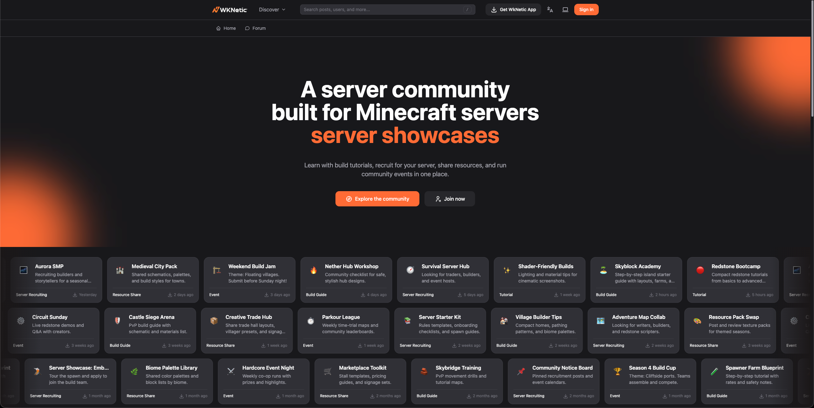
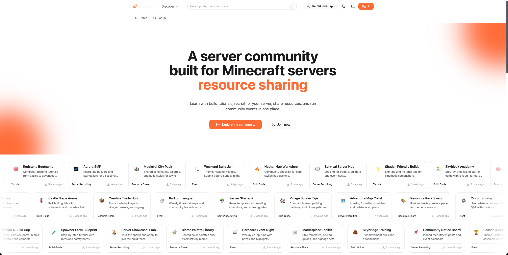
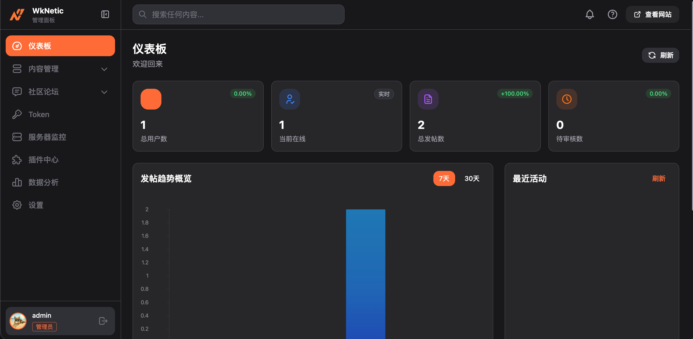
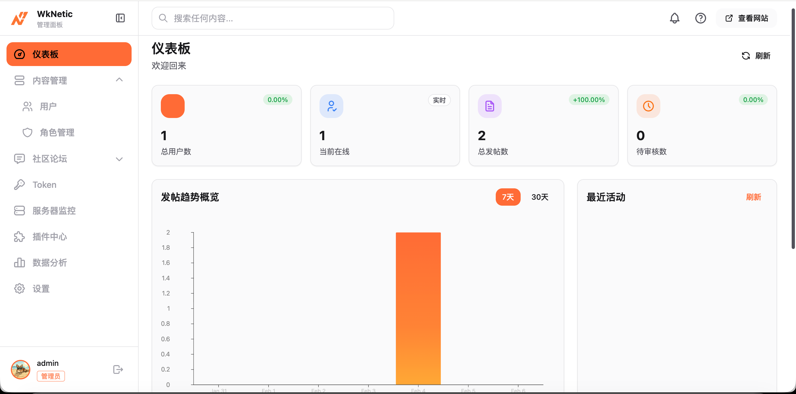
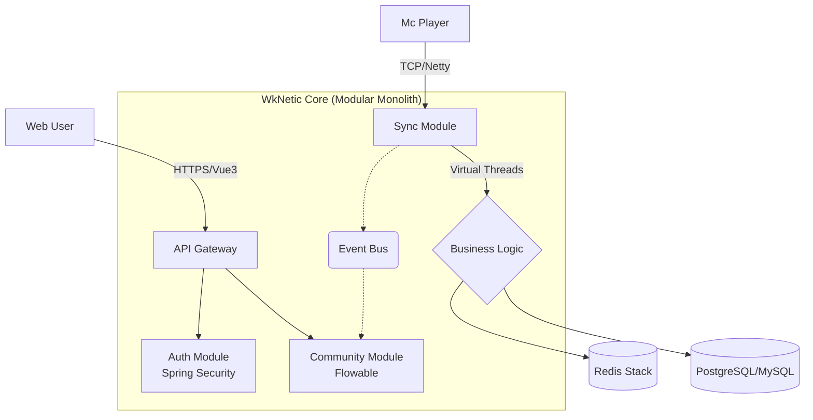

<div align="center">

# ⚡ WkNetic

**A Modular Monolithic Solution Bridging the Minecraft Game World and Web Communities**

[English](./README_en.md) | [简体中文](./README.md)

[](https://openjdk.org/projects/jdk/21/)
[](https://spring.io/projects/spring-boot)
[](https://vuejs.org/)
[](https://netty.io/)
[](https://www.docker.com/)
[](https://deepwiki.com/WekyJay/WkNetic)

---

### 🚧 Project Status: Active Development (WIP) 🚧

*The project is currently in early-stage development (Alpha). Star us to follow the progress!*

### 🖼️ Project Preview

| Modern Theme Interface | Pixel Theme Interface |
|------------------------|------------------------|
|  |  |
| **Admin Dashboard** | **Community Forum Interface** |
|  |  |

</div>

## 📖 Introduction

**WkNetic** (Pronounced: `/wikeɪ-ˈnetɪk/`) is an open-source full-stack game community system designed to eliminate the gap between Minecraft servers and the Web.

Unlike traditional forums, WkNetic utilizes **Netty** and **Redis** to achieve millisecond-level bidirectional data synchronization. Built with **Java 21 Virtual Threads**, it ensures extreme performance under high concurrency. With its built-in **Flowable** workflow engine, it provides server owners and developers with an out-of-the-box automated operations experience.

### ✨ Key Features

* **⚡ Kinetic Sync**: Real-time synchronization of in-game chat, status, and inventory data with the web interface via Netty WebSocket.
* **🧵 Virtual Thread Driven**: Fully embraces Java 21 Virtual Threads to handle tens of thousands of concurrent connections effortlessly, eliminating "callback hell."
* **🎨 Pixel & Modern (Dual Theme)**: Built-in SPI theme engine supporting one-click switching between "Modern Minimalist" and "8-bit Pixel" styles.
* **🧩 Modular Monolith**: Modular isolation of source code (Auth/Sync/Community) with lightweight deployment (Single Docker container).

## 🏗️ Architecture Overview



## 🗺️ Roadmap

My goal is to build a long-term maintained open-source project. The current development cycle for 2026 Q1 is planned as follows:

### Phase 1: Infrastructure ✅

* [x] **Project Init**: Setup Maven multi-module architecture (Common, Auth, Admin)
* [x] **Core Utils**: Encapsulate `ThreadUtil` (Java 21 Virtual Thread support)
* [x] **Response**: Define unified response body `Result<T>` and global exception handling
* [x] **Database**: Complete database schema design (User, Role, Config, Log)

### Phase 2: Security & Authentication ✅

* [x] **Auth**: Integrate Spring Security for JWT login and renewal
* [x] **RBAC**: Role-Based Access Control system implementation
* [x] **Config**: Dynamic system configuration management (site settings, captcha config, etc.)
* [x] **Log**: Asynchronous logging based on AOP + Virtual Threads
* [x] **UI**: Login page implementation with Vue3 + UnoCSS

### Phase 3: The Kinetic Core ✅

* [x] **Netty Server**: Implement WebSocket server and heartbeat detection
* [x] **Spigot Client**: Develop the Netty Client for the Minecraft plugin side
* [x] **Protocol**: Define message protocol and serialization standards
* [x] **Chat Sync**: Bidirectional chat synchronization between Web and Game
* [x] **Server Token**: Token-based server authentication system
* [x] **Server Monitor**: Remote server monitoring and command execution
* [x] **Player Sync**: Player login/logout status synchronization
* [x] **Data Stream**: Real-time data streaming and metadata sync (Redis Pub/Sub)

### Phase 4: Community & Extension ✅

* [x] **Plugin System**: User plugin management infrastructure
* [x] **Extension Slot**: Vue3 plugin extension points and dynamic component loading
* [x] **Admin Panel**: Backend admin panel (User/Role/Config/Log/Server management)
* [x] **Forum System**: Core forum functionality (Posts/Comments/Topics/Tags)
* [x] **Social Features**: Social interactions (Likes/Bookmarks/Follow/Notifications)
* [x] **Content Moderation**: Content review and reporting system
* [x] **Search Engine**: Elasticsearch full-text search integration
* [x] **SPI Loader**: Complete plugin lifecycle management
* [x] **Theming**: `theme.css` design system and pixel art theme adaptation

### Phase 5: Delivery

* [x] **Docker**: Multi-stage Dockerfile configuration
* [ ] **CI/CD**: Configure GitHub Actions for automated builds
* [ ] **Release**: Publish v1.0.0-alpha version

---

## 🛠️ Tech Stack

| **Domain** | **Technology** | **Reasoning** |
| --- | --- | --- |
| **Backend** | Spring Boot 3.5.9 + Java 21 | Leveraging Virtual Threads to simplify high-concurrency programming. |
| **Network** | Netty 4.1 | The industry standard for high-performance game communication. |
| **Frontend** | Vue 3 + Vite + Pinia | Reactive and high-performance component-based development. |
| **Style** | UnoCSS | Atomic CSS for easy theme customization. |
| **Database** | MySQL 8 / Redis | Persistence and high-speed caching. |
| **DevOps** | Docker Compose | One-click, out-of-the-box deployment. |

## 🐳 Docker Quick Deployment

WkNetic provides a complete Docker deployment solution supporting one-click startup of all services.

### Using Docker Compose (Recommended)

```bash
# Clone the project
git clone https://github.com/WekyJay/WkNetic.git
cd WkNetic

# Start all services
docker-compose up -d

# Check service status
docker-compose ps

# Stop services
docker-compose down
```

### Using Docker Hub Images

```bash
# Pull latest images
docker pull wekyjay/wknetic-backend:latest
docker pull wekyjay/wknetic-frontend:latest

# Run backend service
docker run -d \
  --name wknetic-backend \
  -p 8080:8080 \
  -e SPRING_PROFILES_ACTIVE=prod \
  wekyjay/wknetic-backend:latest

# Run frontend service
docker run -d \
  --name wknetic-frontend \
  -p 80:80 \
  wekyjay/wknetic-frontend:latest
```

### Environment Configuration

Default configuration is included in `docker-compose.yml`. For custom configuration:

1. Copy environment file:
   ```bash
   cp docker/.env.example docker/.env
   ```

2. Edit `docker/.env` file to configure database, Redis, etc.

3. Start services:
   ```bash
   docker-compose --env-file docker/.env up -d
   ```

### Access Services

- **Frontend Interface**: http://localhost
- **Backend API**: http://localhost:8080
- **API Documentation**: http://localhost:8080/swagger-ui.html

### Data Persistence

Docker container data is stored in named volumes by default:
- `wknetic_mysql_data`: MySQL database data
- `wknetic_redis_data`: Redis data
- `wknetic_elasticsearch_data`: Elasticsearch data

## 🎯 Implemented Core Features

### 🔐 System & Authentication
- ✅ JWT authentication with automatic token renewal
- ✅ RBAC role-based access control (Admin/Moderator/VIP/User/Banned)
- ✅ Dynamic system configuration management
- ✅ AOP-based operation logging
- ✅ Server token authentication & management

### 💬 Forum Community
- ✅ Post creation, editing, and review workflow
- ✅ Nested comments and reply system
- ✅ Topic categories and tag management
- ✅ Like, bookmark, and follow features
- ✅ Content reporting and moderation system
- ✅ Real-time notification push
- ✅ Elasticsearch full-text search

### 🔌 Server Integration
- ✅ Netty WebSocket bidirectional communication
- ✅ In-game chat synchronized with web interface
- ✅ Remote server monitoring dashboard
- ✅ Remote command execution
- ✅ Heartbeat detection and auto-reconnection

### 🎨 Frontend Experience
- ✅ Vue3 + Pinia state management
- ✅ UnoCSS atomic styling system
- ✅ Dark/Pixel dual theme switching
- ✅ User plugin extension system
- ✅ Markdown editor with live preview

### 🛠️ Admin Panel
- ✅ User management (CRUD + batch operations)
- ✅ Role and permission management
- ✅ Topic and tag management
- ✅ Post moderation workbench
- ✅ Server token management
- ✅ System configuration center
- ✅ Operation log queries

## 🤝 Contributing

The project is currently in the core construction phase. If you are interested in **Java 21**, **Minecraft Plugin Development**, or **Pixel Art UI**, please feel free to Star the repo and follow the Issue list.
