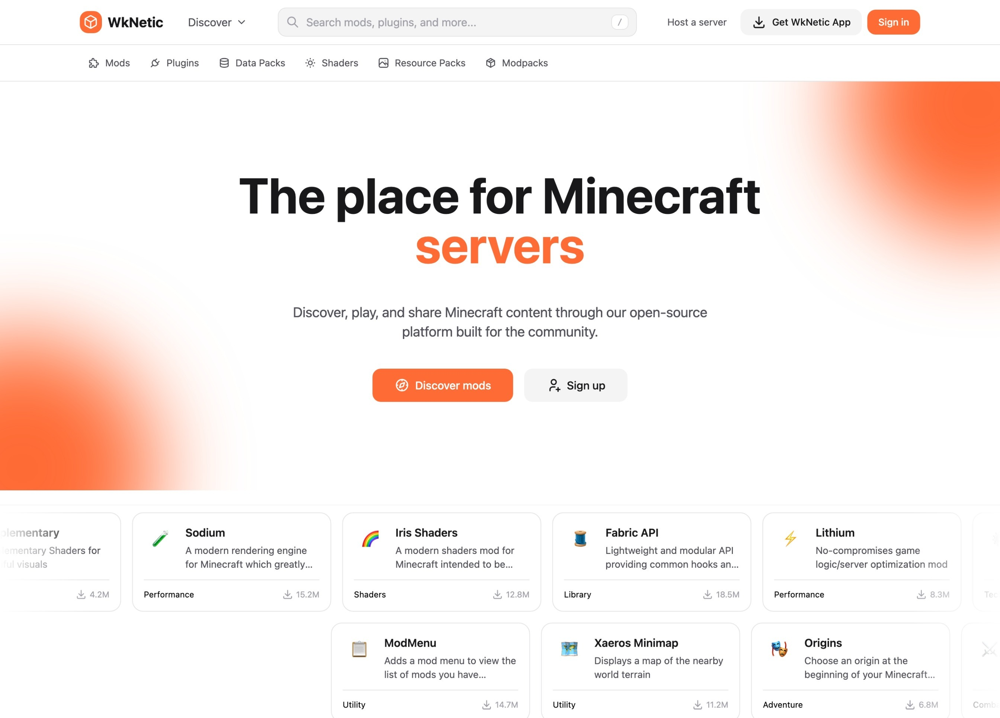
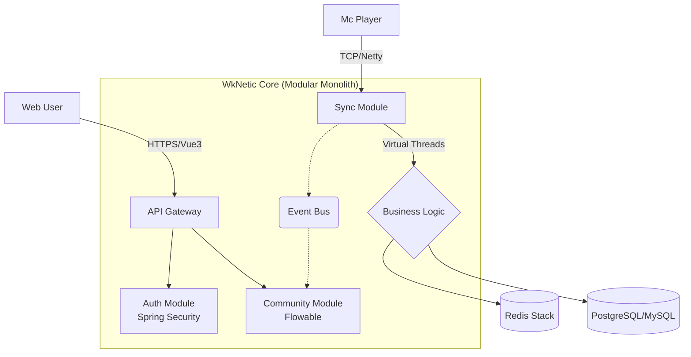

Here is the translated English version of your README. It maintains the technical terminology while ensuring the tone is professional and engaging for the international developer community.

---

# ⚡ WkNetic

**A Modular Monolithic Solution Bridging the Minecraft Game World and Web Communities**

[English](./README_en.md) | [简体中文](./README.md)

---

### 🚧 Project Status: Active Development (WIP) 🚧

*The project is currently in early-stage development (Alpha). Star us to follow the progress!*

## 📖 Introduction

**WkNetic** (Pronounced: `/wikeɪ-ˈnetɪk/`) is an open-source full-stack game community system designed to eliminate the gap between Minecraft servers and the Web.

Unlike traditional forums, WkNetic utilizes **Netty** and **Redis** to achieve millisecond-level bidirectional data synchronization. Built with **Java 21 Virtual Threads**, it ensures extreme performance under high concurrency. With its built-in **Flowable** workflow engine, it provides server owners and developers with an out-of-the-box automated operations experience.

### ✨ Key Features

* **⚡ Kinetic Sync**: Real-time synchronization of in-game chat, status, and inventory data with the web interface via Netty WebSocket.
* **🧵 Virtual Thread Driven**: Fully embraces Java 21 Virtual Threads to handle tens of thousands of concurrent connections effortlessly, eliminating "callback hell."
* **🎨 Pixel & Modern (Dual Theme)**: Built-in SPI theme engine supporting one-click switching between "Modern Minimalist" and "8-bit Pixel" styles.
* **🧩 Modular Monolith**: Modular isolation of source code (Auth/Sync/Community) with lightweight deployment (Single Docker container).

## 🏗️ Architecture Overview

## 🗺️ Roadmap

My goal is to build a long-term maintained open-source project. The current development cycle for 2026 Q1 is planned as follows:

### Phase 1: Infrastructure ✅

* [x] **Project Init**: Setup Maven multi-module architecture (Common, Auth, Admin)
* [x] **Core Utils**: Encapsulate `ThreadUtil` (Java 21 Virtual Thread support)
* [x] **Response**: Define unified response body `Result<T>` and global exception handling
* [x] **Database**: Complete database schema design (User, Role, Config, Log)

### Phase 2: Security & Authentication ✅

* [x] **Auth**: Integrate Spring Security for JWT login and renewal
* [x] **RBAC**: Role-Based Access Control system implementation
* [x] **Config**: Dynamic system configuration management (site settings, captcha config, etc.)
* [x] **Log**: Asynchronous logging based on AOP + Virtual Threads
* [x] **UI**: Login page implementation with Vue3 + UnoCSS

### Phase 3: The Kinetic Core 🚧

* [x] **Netty Server**: Implement WebSocket server and heartbeat detection
* [x] **Spigot Client**: Develop the Netty Client for the Minecraft plugin side
* [x] **Protocol**: Define message protocol and serialization standards
* [ ] **Chat Sync**: Bidirectional chat synchronization between Web and Game `In Progress`
* [ ] **Player Sync**: Player login/logout status synchronization
* [ ] **Data Stream**: Real-time data streaming and metadata sync (Redis Pub/Sub)

### Phase 4: Community & Extension

* [x] **Plugin System**: User plugin management infrastructure
* [ ] **Extension Slot**: Vue3 plugin extension points and dynamic component loading
* [ ] **Admin Panel**: Backend admin panel (User/Role/Config/Log management)
* [ ] **SPI Loader**: Complete plugin lifecycle management
* [ ] **Theming**: `tokens.css` design system and pixel art theme adaptation

### Phase 5: Delivery

* [ ] **Docker**: Multi-stage Dockerfile configuration
* [ ] **CI/CD**: Configure GitHub Actions for automated builds
* [ ] **Release**: Publish v1.0.0-alpha version

---

## 🛠️ Tech Stack

| **Domain** | **Technology** | **Reasoning** |
| --- | --- | --- |
| **Backend** | Spring Boot 3.5.9 + Java 21 | Leveraging Virtual Threads to simplify high-concurrency programming. |
| **Network** | Netty 4.1 | The industry standard for high-performance game communication. |
| **Frontend** | Vue 3 + Vite + Pinia | Reactive and high-performance component-based development. |
| **Style** | UnoCSS | Atomic CSS for easy theme customization. |
| **Database** | MySQL 8 / Redis | Persistence and high-speed caching. |
| **DevOps** | Docker Compose | One-click, out-of-the-box deployment. |

## 🤝 Contributing

The project is currently in the core construction phase. If you are interested in **Java 21**, **Minecraft Plugin Development**, or **Pixel Art UI**, please feel free to Star the repo and follow the Issue list.

---

**Would you like me to generate a specific `CONTRIBUTING.md` file or a more detailed technical specification for the "Kinetic Core" module?**